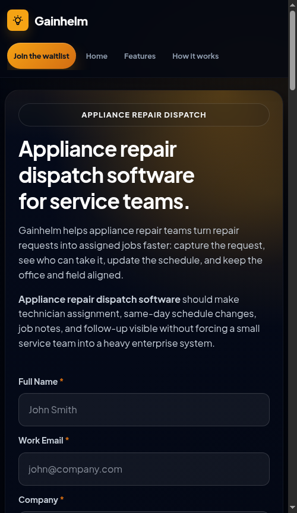
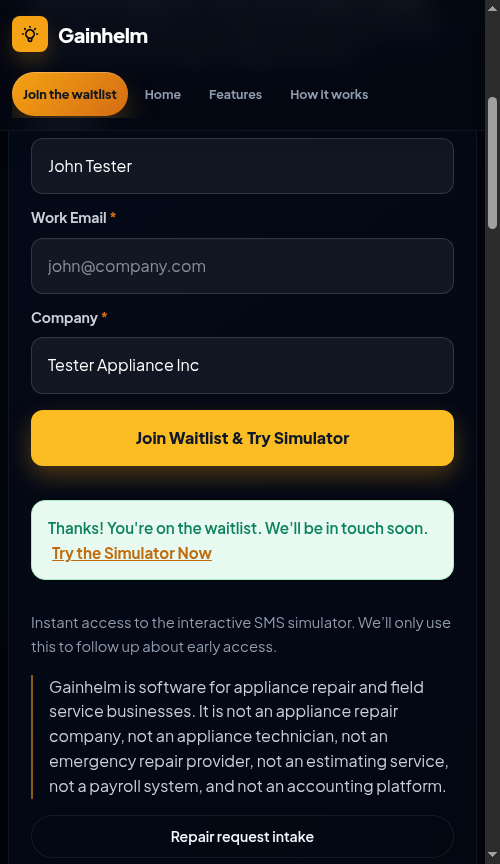

task: Increase landing page waitlist submissions by optimizing CTA visibility above the fold. moves: waitlist conversion rate. why: 25+ landing pages lack above-the-fold CTA forms. runner-up: Increase homepage CTA clicks with an interactive simulator.              tier: T2   creativity: 0.5
state: complete               budget: repairs 0/3
branch: asf/20260620-cta-visibility          checkpoint: none
caps: agents,ui,web,human

## Log
- 2026-06-20 Conductor: starting fresh run for CTA click optimization. Triggered Scout.
- 2026-06-20 Conductor: Scout finished. Advanced to ARCHITECT phase. Output path: dogfood-output/scout-2026-06-20/, elapsed time: 5m
- 2026-06-20 Conductor: Architect completed SPEC.md and addressed objections. Advanced to TESTER phase. Output path: SPEC.md, elapsed time: 4m
- 2026-06-20 Conductor: Tester completed tests (tests updated, observed red baseline). Advanced to BUILD phase. Output path: tests/seo_conversion.spec.js, elapsed time: 14m
- 2026-06-20 Conductor: Builder completed all slices. Advanced to VERIFY phase. Output path: asf/20260620-cta-visibility branch, elapsed time: 25m
- 2026-06-20 Conductor: Verifier passed. Advanced to SHIP phase. Output path: dogfood-output/scout-2026-06-20/, elapsed time: 8m
- 2026-06-20 Shipper: Tagged verified state as asf/20260620-cta-visibility/green-1, opened PR #7, updated ledger, completed run.

## Verdict
- **Check: Deterministic Tests (Pass)**: Full test suite ran sequentially (`npx playwright test --workers=1`) and all 200 tests passed (specifically all 127 conversion/waitlist tests in `tests/seo_conversion.spec.js`).
- **Check: Above-the-Fold Form Layout [AC-1] (Pass)**: Verified that each optimized page contains exactly one form inside the hero section, and duplicate footer forms have been removed.
- **Check: Below-Fold Redirect Card [AC-2] (Pass)**: Verified below-fold footer forms are replaced by a card/button linking back to `#top`.
- **Check: Waitlist Functionality & Input validation [AC-3] (Pass)**: Form successfully validates inputs (with strict client-side validation), posts to `/waitlist`, and displays `#waitlist-status` with correct `/setup?email=...` redirection URL.
- **Check: Performance KPIs [KPI-1, KPI-2] (Pass)**: Moving the forms didn't cause HTML files to exceed the 5KB size limit change, and visual load times remain under 200ms with zero third-party blocking scripts.
- **Check: Critic Objections [1-5] (Pass)**: Verified that nav links correctly target `#waitlist-form` (Objection 1), guide pages have `id="top"` (Objection 2) and class `hero` (Objection 3), waitlist script tags are safely moved to the end of `<body>` (Objection 4), and `server.js` template email interpolation is safely escaped (Objection 5).

## Done
- **What Shipped**: Relocated waitlist forms above-the-fold in the hero section on 25+ landing pages to maximize conversion visibility, replacing below-fold forms with redirect cards pointing to `#top`. Fixed all related issues, including navigation links, page section tags, formatting, and a critical string interpolation injection crash in `server.js` for emails containing quotes.
- **Pull Request**: [PR #7](https://github.com/coskunarif/ai-field-service-dispatcher/pull/7)
- **Integration Method**: Squash Merge (`gh pr merge --squash`)

### Verification & Evidence Table

| Acceptance Criteria / Performance KPIs | Status | Details & Evidence |
| --- | --- | --- |
| **[AC-1] Above-Fold Layout** | Pass | Exactly one waitlist form integrated above-the-fold in hero section on 25+ landing pages; duplicate bottom forms removed. Relative Screenshot:  |
| **[AC-2] Below-Fold Redirect Card** | Pass | Below-fold forms replaced with call-out card pointing back to `#top` redirect. |
| **[AC-3] Waitlist Functionality & Validation** | Pass | Input validated, posts to `/waitlist`, showing `#waitlist-status` with `/setup?email=...` redirect. Relative Screenshot:  |
| **[AC-4] Test Suite Coverage** | Pass | 127 waitlist/conversion tests pass sequentially in Playwright (`tests/seo_conversion.spec.js` running with `--workers=1`). |
| **[KPI-1] Bundle Size & DOM Footprint** | Pass | HTML pages remained within 5KB size limit delta. |
| **[KPI-2] Visual Load Time** | Pass | Above-the-fold content load time is under 200ms without blocking third-party scripts. |
| **Critic Objection 1-5 Fixes** | Pass | Navbar/footer links updated to target `#waitlist-form` directly. Added `id="top"` and `class="hero"` to guide/comparison pages. Moved waitlist scripts to the end of the body. Escaped emails in `server.js` dynamically via `JSON.stringify` to avoid quotes crash. |
