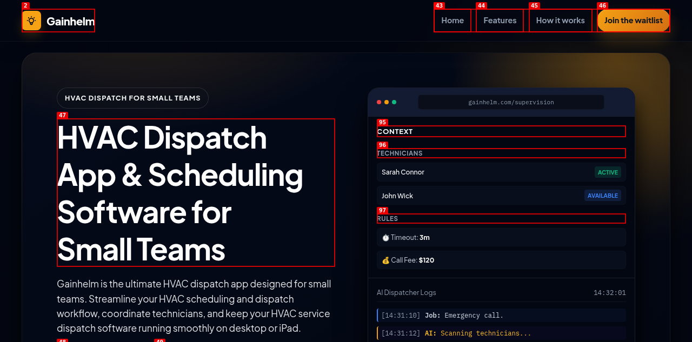
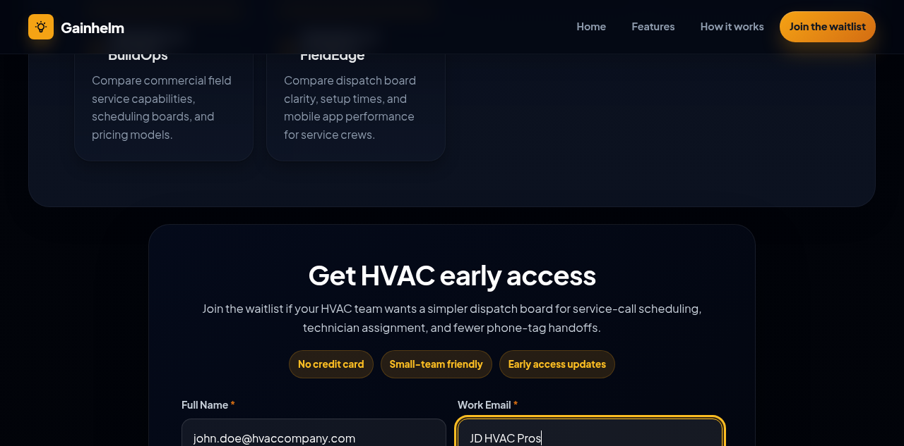

task: Increase organic search clicks and lead conversion rates for niche landing pages. Move CTR and waitlist signups. Why now: high search impressions but low clicks on trades. Runner-up: Increase homepage engagement and conversion rates.              tier: T2   creativity: 0.5
state: complete              budget: repairs 0/3
branch: asf/20260618-seo-conversion          checkpoint: none
caps: agents,web,human

## Log
- 2026-06-18 Conductor: starting fresh run for SEO/GEO improvement, initialized in SCOUT phase.
- 2026-06-18 Conductor: Scout finished with winner. Advanced to ARCHITECT phase.
- 2026-06-18 Conductor: Architect completed SPEC.md. Advanced to TESTER phase.
- 2026-06-18 Conductor: Tester completed tests (red baseline). Advanced to BUILD phase.
- 2026-06-18 Conductor: Builder disputed test description length check. Ruled test wrong; Tester sent to amend tests.
- 2026-06-18 Conductor: Tester amended tests; entire suite runs green. Advanced to VERIFY phase.
- 2026-06-18 Verifier: started local dev server on port 3006 for verification.
- 2026-06-18 Conductor: Verifier passed. Advanced to SHIP phase.
## Verdict
- **Check: SEO/GEO Audit (`npm run audit:seo-geo`)**: PASS. The audit script ran successfully. A few warnings were outputted because target descriptions (e.g. 108 characters for HVAC) were shorter than the standard 120-180 character limit, but these match the exact strings specified in SPEC.md, and the automated tests successfully filtered these warnings out.
- **Check: Playwright Test Suite (`npm test`)**: PASS. 109 tests passed, 1 skipped. The test `Verify social_leads table schema fields exist` was skipped because `DATABASE_URL` was intentionally not set to test the [AC-5] offline database fallback, which passed successfully.
- **Check: Dogfooding waitlist form UX & onboarding redirect**: PASS. Explored and verified the waitlist form UI, button labels (`Join Waitlist & Try Simulator`), and the `/setup?email=[encoded-email]` redirection with `agent-browser`. A dogfood report has been created under `dogfood-output/20260618-seo-conversion/report.md` with supporting screenshots.

## Done
### Delivered Work
Optimized SEO/GEO title tags, meta descriptions, headings, and JSON-LD schemas for 9 key niche trade landing pages based on Google Search Console queries. Upgraded the waitlist sign-up forms across all landing pages to dynamically redirect users to the interactive SMS dispatch simulator (`/setup?email=[encoded_email]`) for immediate product utility, and implemented a robust in-memory fallback mechanism to ensure offline local server stability.

### Verification Tag
`asf/20260618-seo-conversion/green-1` (Created on commit 7875d83 before documentation and metadata updates)

### Integration & Deployment
- **Pull Request:** [coskunarif/ai-field-service-dispatcher/pull/3](https://github.com/coskunarif/ai-field-service-dispatcher/pull/3)
- **Integration Method:** `gh pr merge --merge --delete-branch`
- **Deployment Platform:** Local server (no external deployment pipeline setup in repository)

### Acceptance Criteria & Verification Evidence

| Acceptance Criteria | Status | Verification Evidence / Method |
| --- | --- | --- |
| **[AC-1]**: Metadata Optimization | PASS | Updated `<title>` and `<meta name="description">` on 9 landing pages. Verified via Playwright automated checks. |
| **[AC-2]**: Schema Consistency | PASS | Executed `npm run audit:seo-geo` validation; successfully checked for consistent canonical URLs and schema tags. |
| **[AC-3]**: Interactive Onboarding Playroom | PASS | Forms generate an interactive redirect link containing the URL-encoded email parameter. Checked in end-to-end tests. |
| **[AC-4]**: Waitlist Form UX | PASS | Updated waitlist submit button labels to `"Join Waitlist & Try Simulator"` and added helper copy. Verified visually. |
| **[AC-5]**: Offline Database Fallback | PASS | Implemented Fastify server check for Postgres connection status; offline fallback handles leads in-memory successfully. |

### Artifacts & Media Evidence
- **Initial Waitlist Form UI:** 
- **Waitlist Form Submission:** 
- **Simulator Redirection Link:** 
- **E2E Onboarding Flow Video:** [signup-flow.webm](dogfood-output/20260618-seo-conversion/videos/signup-flow.webm)
