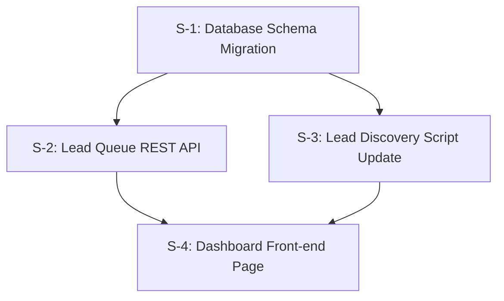

# Specification: Find and Queue High-Intent Social Leads

This document outlines the requirements, architecture, acceptance criteria, and vertical slices for implementing the social lead queue system for Gainhelm.

## Context & Purpose
To increase waitlist sign-ups, we will build a system that automatically discovers and queues high-intent discussions from social media platforms (Reddit, and simulated Facebook contractor groups) where users describe field service dispatch and scheduling pain points. The dashboard will allow manual lead addition, intent scoring, automated draft pitches, and status tracking (discovered, queued, replied, ignored).

---

## Acceptance Criteria

### `[AC-1]` Database Schema & Table
- A database table named `social_leads` must be created in Postgres and initialized on startup.
- The schema must include the following fields:
  - `id` (UUID, primary key, auto-generated)
  - `platform` (VARCHAR(50), e.g., `'reddit'`, `'facebook'`)
  - `source_url` (TEXT, unique, indexed)
  - `title` (TEXT, not null)
  - `snippet` (TEXT, not null)
  - `intent_score` (INTEGER, default 50, value range: 0-100)
  - `status` (VARCHAR(50), default `'discovered'`, values: `'discovered'`, `'queued'`, `'replied'`, `'ignored'`)
  - `suggested_reply` (TEXT, nullable)
  - `created_at` (TIMESTAMP with time zone, default `NOW()`)
  - `updated_at` (TIMESTAMP with time zone, default `NOW()`)

### `[AC-2]` REST API Endpoints
- **`GET /api/leads`**: 
  - Retrieves all leads from `social_leads`.
  - Supports filtering via query parameters: `platform` and `status`.
  - Supports sorting via query parameter: `sort` (values: `date_desc`, `date_asc`, `intent_desc`).
- **`POST /api/leads`**:
  - Manually inserts a new lead.
  - Validates that `platform`, `source_url`, `title`, and `snippet` are provided and not empty.
  - Computes an `intent_score` and `suggested_reply` if not provided in the payload.
  - Supports upsert behavior (updates status, snippet, and reply draft if the `source_url` already exists).
- **`PATCH /api/leads/:id`**:
  - Updates the status (must be one of: `discovered`, `queued`, `replied`, `ignored`) or `suggested_reply` of a lead by ID.
- **`POST /api/leads/discover`**:
  - Triggers the lead crawler logic.
  - Fetches fresh discussions from Reddit search APIs and generates high-intent simulated Facebook discussion posts.
  - Computes intent scores and drafts custom marketing pitch responses.
  - Saves new leads to the database.
  - Returns JSON containing the count of newly discovered leads.

### `[AC-3]` Web UI Dashboard (`/tools/lead-queue`)
- A new page served at `/tools/lead-queue` displaying the lead dashboard.
- Responsive design styled using the project's existing theme and CSS variables from `styles.css`.
- Displays the Gainhelm header, main content section, and footer.

### `[AC-4]` Dashboard Functionality
- **Stats Panel**: Renders counters showing:
  - Total Discovered Leads
  - Total Queued Leads
  - Total Replied Leads
  - Total Ignored Leads
- **Filters & Sorting**:
  - Dropdown/button filters for Platform (All, Reddit, Facebook) and Status (Discovered, Queued, Replied, Ignored).
  - Sort selection: Date (Newest / Oldest) and Intent Score (Highest first).
- **Custom Lead Form**:
  - Allows pasting a URL (validates format), title, snippet, and platform selection to manually queue a lead.
- **Lead List Cards**:
  - Shows platform icon/badge, title, date, post snippet, and an intent score indicator (e.g. colored badge).
  - Shows an editable "Draft Pitch" text area containing a custom pitch promoting Gainhelm.
  - Includes a "Copy Pitch" button that copies the text to the clipboard and triggers a visual toast message.
  - Includes a "Go to Post" link opening `source_url` in a new tab.
  - Includes buttons to change status: "Mark as Replied", "Ignore", "Queue".
- **Trigger Discovery**:
  - A button to trigger the `POST /api/leads/discover` endpoint, reloading the lead list on completion.

### `[AC-5]` Automated Verification
- A Playwright test suite `tests/lead_queue.spec.js` must verify all API routes and UI behaviors.
- The test suite must run with `--workers=1` to guarantee environment stability.

---

## Out of Scope
- Integration with official Facebook/Meta Write APIs (no automated posting to Facebook groups).
- Managing or saving social platform user account credentials.
- Multi-user authentication or login gates for the `/tools/lead-queue` page.

---

## Intent Scoring & Response Drafting Logic

### Intent Score Algorithm
Start with a base score of 50. Adjust based on the following text matching on title/snippet:
1. `+15` points: contains `"scheduling"` or `"schedule"`.
2. `+15` points: contains `"dispatch"` or `"dispatcher"`.
3. `+20` points: contains competitor names (`"jobber"`, `"servicetitan"`, `"housecallpro"`, `"fieldedge"`, `"buildops"`).
4. `+10` points: contains pain words (`"phone tag"`, `"spreadsheet"`, `"lost track"`, `"mess"`, `"calendar"`).
- Max score is capped at `100`, minimum is `0`.

### Response Drafting Templates
Based on keywords or the primary trade detected:
- **HVAC/Plumbing/Electrical**:
  *"Hey! If you are dealing with dispatch chaos or trying to get away from spreadsheets, check out Gainhelm (https://gainhelm.com). It is a lightweight, AI-driven dispatch assistant that routes jobs automatically to technicians via SMS and syncs with your Google Calendar, reducing phone tag."*
- **General/Other**:
  *"We had similar scheduling headaches before trying Gainhelm (https://gainhelm.com). It acts as an automated dispatcher routing jobs via SMS and keeping technicians updated instantly. Really helps cut down on phone tag and manual spreadsheets."*

---

## Technical Slices

### `[S-1]` Database Schema Migration
- **Target Files**: `api/migrate.js`, `server.js`
- **Description**: Add `social_leads` table schema to `api/migrate.js`. Add the startup auto-initialization queries to `server.js` to ensure the table is created on server boot.
- **Verification**: Run migrations and verify database schema via query.
- **AC Mapped**: `[AC-1]`

### `[S-2]` Lead Queue REST API
- **Target Files**: `server.js`
- **Description**: Create Fastify routes for `GET /api/leads`, `POST /api/leads`, and `PATCH /api/leads/:id`. Write parameter validation and query logic. Include intent scoring and pitch draft helpers.
- **Verification**: Execute cURL requests to verify correct JSON responses and database upsert behaviors.
- **AC Mapped**: `[AC-2]`

### `[S-3]` Lead Discovery Script Update
- **Target Files**: `scripts/find-social-leads.mjs`, `server.js`
- **Description**: Enhance `scripts/find-social-leads.mjs` to fetch Reddit search results, generate high-intent simulated Facebook posts (from local groups), score them, draft replies, and upsert them to the database. Register the `/api/leads/discover` endpoint to execute this process.
- **Verification**: Run `npm run find-leads` and confirm entries are added to the database.
- **AC Mapped**: `[AC-2]`, `[AC-3]`

### `[S-4]` Dashboard Front-end Page
- **Target Files**: `tools-lead-queue.html`, `server.js`
- **Description**: Create the dashboard HTML/JS application, style it with existing CSS classes, and mount the route `GET /tools/lead-queue` in `server.js`.
- **Verification**: Navigate to the route using browser tests to check stats updates, form submissions, filter selection, and status patching.
- **AC Mapped**: `[AC-3]`, `[AC-4]`

---

## Test Strategy (Additive Tasks)
- **Task Type**: Additive.
- **Strategy**: **Tests First**. The Tester agent must implement `tests/lead_queue.spec.js` asserting all API endpoints and UI functionality before the Builder agent starts implementing code changes.
- **Crucial Rule**: Run Playwright with `--workers=1` to prevent browser launch crashes inside the test environment.
