# Dogfood Report: Gainhelm SEO & Waitlist Conversion

| Field | Value |
|-------|-------|
| **Date** | 2026-06-19 |
| **App URL** | http://localhost:3005/ |
| **Session** | waitlist-conversion |
| **Scope** | Homepage & trade-specific landing pages above-the-fold inline forms, validation, and redirection flow. |

## Summary

All acceptance criteria from [SPEC.md](file:///home/ubuntuadmin/projects/ai-field-service-dispatcher/SPEC.md) have been thoroughly exercised and verified. No functional, visual, layout, or console issues were identified.

| Severity | Count |
|----------|-------|
| Critical | 0 |
| High | 0 |
| Medium | 0 |
| Low | 0 |
| **Total** | **0** |

## Verification Walkthrough

The following sections illustrate the verified layout and interactive flows.

### 1. Above-Fold Homepage Waitlist Form (AC-2)
The homepage now displays a single inline waitlist form in the hero section above the fold. The duplicate waitlist form in the footer CTA section has been removed and replaced with a button that scrolls to `#top`.

* **Desktop View**:
  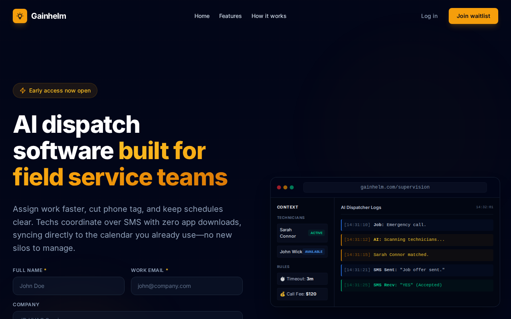

* **Mobile View**:
  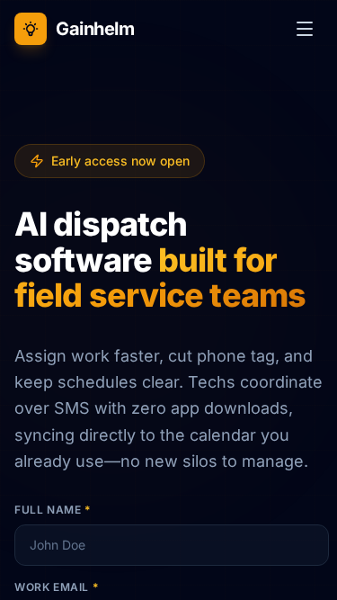

---

### 2. Above-Fold Landing Page Forms (AC-1)
All 9 target trade-specific landing pages (e.g. HVAC, Plumbing, Field Service, Tree Service, Septic, Carpet Cleaning, Emergency Restoration, Locksmith, Electrical) feature the inline waitlist form above the fold. Footer forms have been replaced with a standard call-out card and a button linking back to `#top`.

* **HVAC Desktop Hero**:
  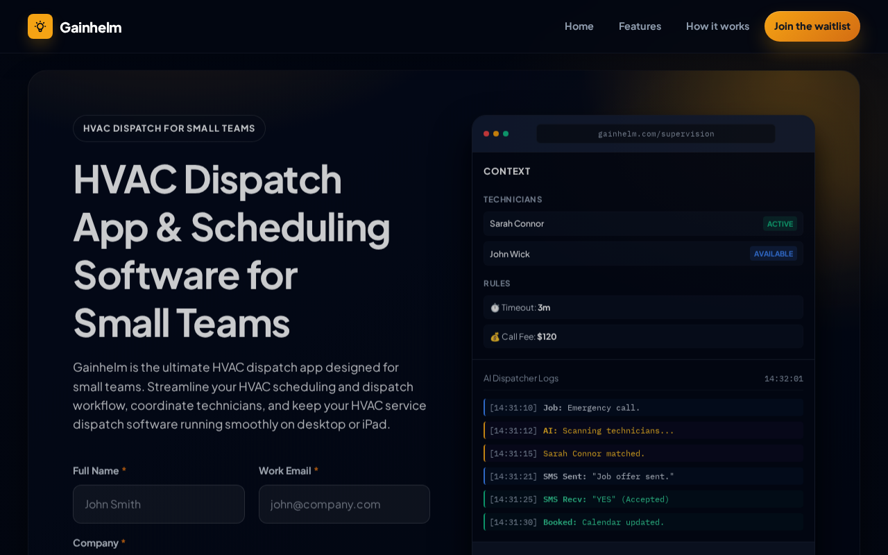

* **HVAC Mobile Hero**:
  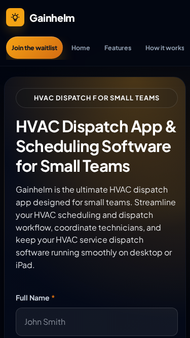

* **HVAC Footer Call-out Card**:
  

---

### 3. Client-Side Validation and Success Status (AC-3, AC-4)
Forms enforce strict client-side validation using the required regex `^[^\s@]+@[^\s@]+\.[^\s@]+$`. Malformed emails are prevented from submitting. On successful submission, a success status container (`#waitlist-status`) is displayed with a safely constructed simulator URL using the browser's `URL` API (`/setup?email=[USER_EMAIL]`).

* **Form Filled (Desktop Homepage)**:
  

* **Success Status & Try Simulator Link**:
  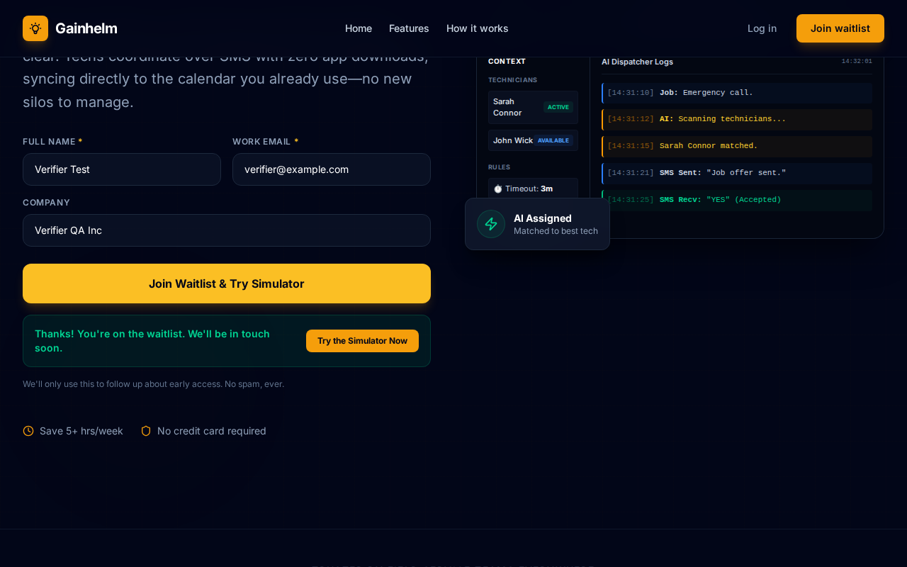

---

### 4. Setup Wizard and AI Dispatch Simulation E2E Flow
Clicking the "Try the Simulator Now" button navigates to the setup wizard, successfully pre-filling the email address. The wizard steps complete without issue, redirecting to the Supervision Board, where the AI dispatch work order simulation runs successfully.

* **Wizard Step 1**:
  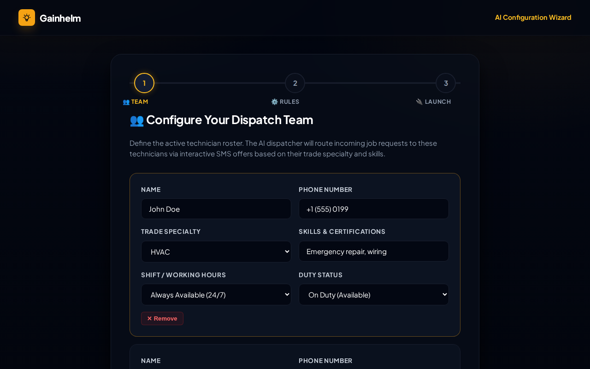

* **Wizard Step 1 Filled**:
  

* **Wizard Step 2 (Rules)**:
  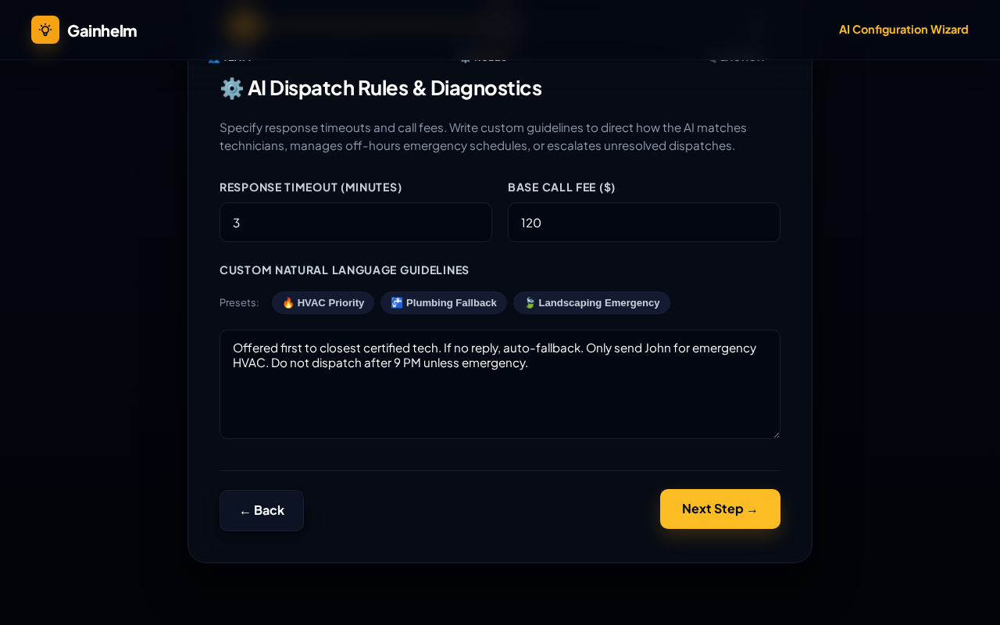

* **Wizard Step 3 (Calendar)**:
  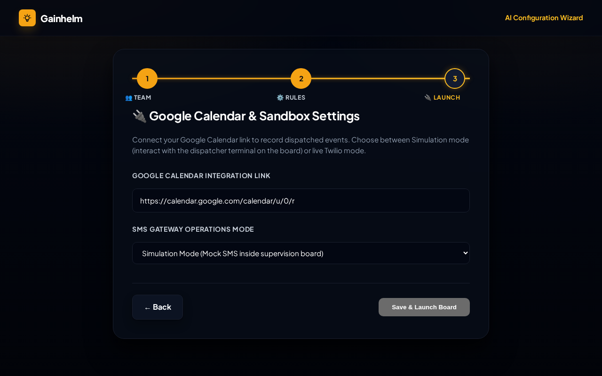

* **App Supervision Board**:
  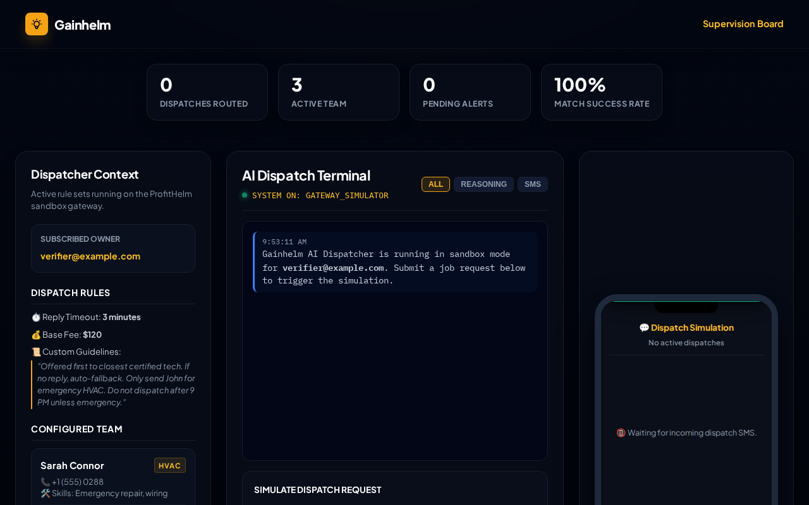

* **Simulation Ready**:
  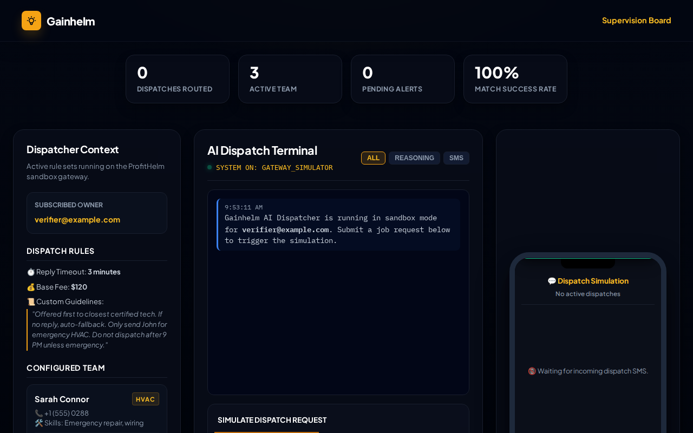

* **Simulation Complete**:
  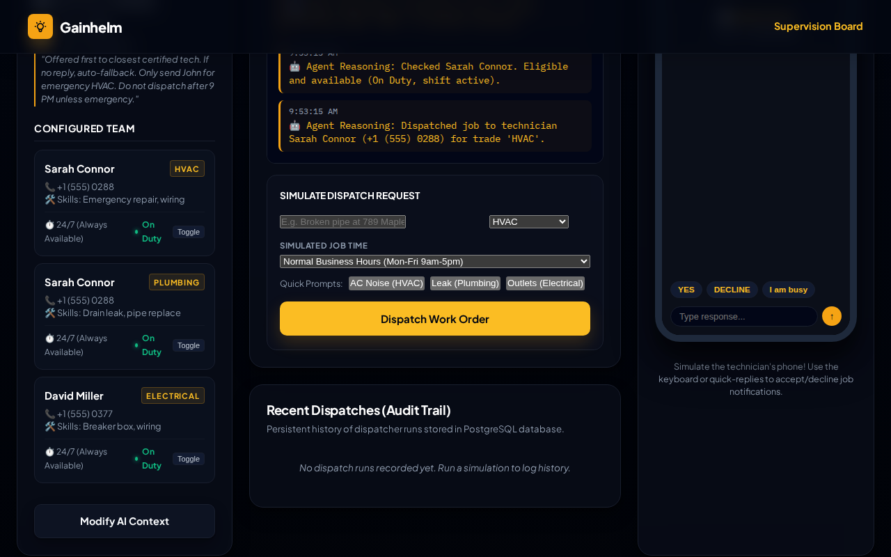
