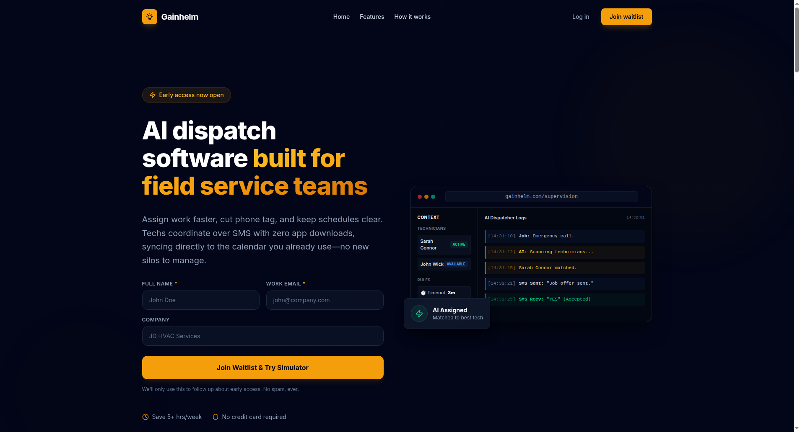

# Dogfood Report: Gainhelm

| Field | Value |
|-------|-------|
| **Date** | 2026-06-20 |
| **App URL** | http://localhost:3005/ |
| **Session** | gainhelm-cta-optimization |
| **Scope** | CTA Clicks and Conversion Flows |

## Summary

| Severity | Count |
|----------|-------|
| Critical | 0 |
| High | 0 |
| Medium | 1 |
| Low | 1 |
| **Total** | **2** |

## Issues

### ISSUE-001: Missing Above-the-Fold Waitlist Forms on 25+ Service Landing Pages

| Field | Value |
|-------|-------|
| **Severity** | medium |
| **Category** | ux |
| **URL** | http://localhost:3005/appliance-repair-dispatch-software |
| **Repro Video** | N/A |

**Description**

On 25+ service-specific landing pages (such as Appliance Repair, Pest Control, Cleaning, Landscaping, etc.), there is no above-the-fold waitlist form. Instead, the hero section has a "Join the waitlist" anchor button linking down to the bottom form section. This forces interested users to scroll or navigate away, introducing conversion friction compared to the 9 target pages that feature inline forms directly in the hero.

**Repro Steps**

1. Navigate to http://localhost:3005/appliance-repair-dispatch-software
   
2. Observe that there is no form input field in the hero, only CTA anchor buttons linking to `#waitlist`.

---

### ISSUE-002: Static Mockup Dashboard Lacks Interactivity on Homepage Hero

| Field | Value |
|-------|-------|
| **Severity** | low |
| **Category** | ux |
| **URL** | http://localhost:3005/ |
| **Repro Video** | N/A |

**Description**

The homepage hero showcases a visually polished "AI Dispatcher Supervision Board" dashboard mockup. However, it is purely static. Making this mockup interactive (allowing users to trigger a simulated dispatch action or input a custom dispatch text before submitting the waitlist form) would showcase direct value and increase the click-through rate of the primary CTA.

**Repro Steps**

1. Navigate to http://localhost:3005/
2. Observe the static Supervision Board preview on the right.
